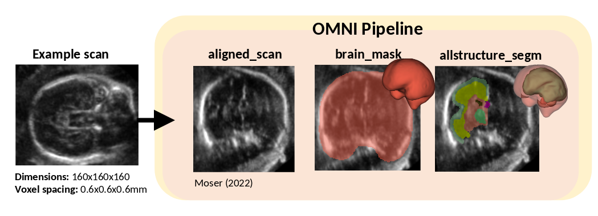

Normative Growth Trajectories
===============

Introduction
------------

Here we provide guidance on how to use this repo to generate the results seen in: **Normative growth trajectories of fetal brain regions validated by satisfactory maturation of neurodevelopmental domains at 2 years of age**

Installation
------------
Install the code following steps in **Getting started**

Pipeline Example
----------------
The following example implements the pipeline used in Normative Growth Trajectories manuscript.

This pipeline will save out, an aligned scan **aligned_scan.nii.gz**, a brain mask used to compute TBV **brain_mask.nii.gz** and the 15 region segmentation **allstructure_segm.nii.gz**.
Segmentation index:

            "CoP": 1,
            "CSP": 2,
            "CB": 3,
            "ChP": 4,
            "LV": 5,
            "DGM": 6,
            "Th": 7,
            "BS": 8,
            "WM": 9,
            "FH": 10,
   

To run the pipeline for multiple scans and with more flexibility, it is recommended to
use the individual pipeline functions rather than the wrapper functions. This ensures that
the models are not reloaded for each scan. The following example demonstrates this for a single
example. 

To ammend for your data: change: $EXAMPLE_IMAGE_PATH and $savefolder

.. literalinclude:: ../../../doc_scripts/growthtraj_pipeline.py

Compute Volume
---------------
To compute the volume of each segmented structure, this minimal example can be used:

.. literalinclude:: ../../../doc_scripts/compute_vol.py

Compare Volume
---------------

The following example shows how to compare your volume measure to the normative growth equations (Suppl Table 8)
   
.. literalinclude:: ../../../doc_scripts/compare_vol.py

