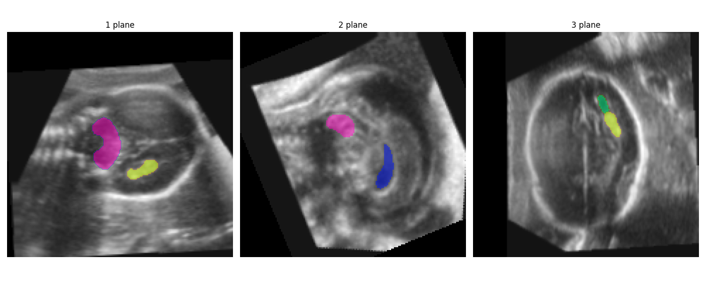

Subcortical segmentation package
=====================================

This package contains a deep learning model for segmenting four subcortical structures: the cerebellum (CB), 
lateral posterior ventricle horns (LPVH), choroid plexus (ChP), and the cavum septum pellucidum et vergae (CSPV). 

The model expects images aligned to the atlas coordinate system as input, that are in their original size (i.e. no 
scaling parameters applied). Segmentations for aligned scaled images can be obtained by applying the scaling factor
to the segmentations. Segmentations for images in their original alignment can be obtained by applying the inverse
alignment transform to the segmentations. Examples on these workflows are provided in the example gallery. 

An example subcortical segmentation can be produced with the following code:

.. literalinclude:: ../../../../src/fetalbrain/doc_scripts/subc_demo.py
   :language: python

Running this results in the following output figure (CB: pink, ChP: yellow, LPVH: green, CSPV: blue):

More details about the segmentation functions are provided in the 

Credits
-------

The code in this package has mainly been developed by Linde Hesse, and the methods are described in detail in a NeuroImage paper. Please
cite this paper if you use the subcortical segmentation model in your research:

`Hesse, L. S., Aliasi, M., Moser, F., INTERGROWTH-21(st) Consortium, Haak, M. C., Xie, W., Jenkinson, M., & Namburete, A. I. L. (2022). 
Subcortical segmentation of the fetal brain in 3D ultrasound using deep learning. NeuroImage (July 2022)
<https://doi.org/10.1016/j.neuroimage.2022.119117>`_

The trained network weights included in the package are from a model trained on a subset of 20 manually annotated fetal brain volumes 
(rather than only 9 as described in the paper). 

Submodules
----------

.. toctree::
   :maxdepth: 4

   subcortical_segm
   segmentation_model

Module contents
---------------

.. automodule:: fetalbrain.structural_segmentation
   :members:
   :undoc-members:
   :show-inheritance:
